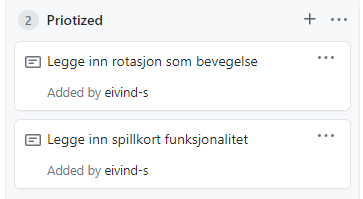
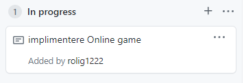
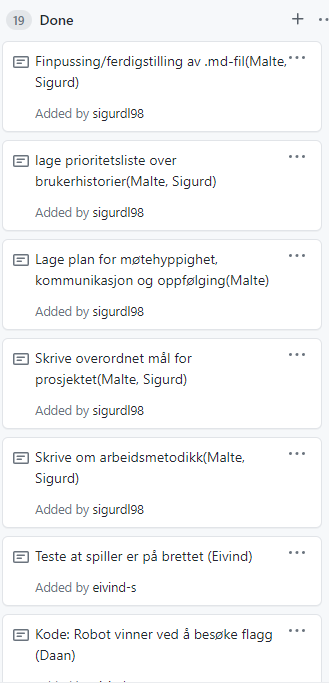
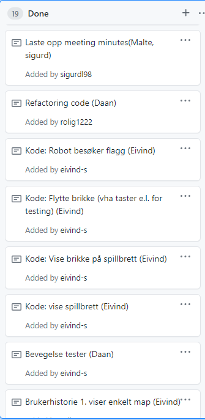
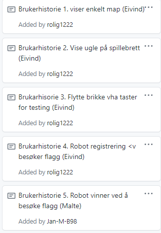

# Obligatorisk Oppgave1

##Deloppgave: Organiser teamet
###Kompetanse 
Sigurd Loennechen - kiq013:
- IKT 4. semester
- har tatt INF100, INF101, INF102
- erfaring med python og java
- har også hatt litt om kunstig intelligens og diskret matematikk

Jan Malte Brunner: - caq008
- 4 semester IKT
- har hatt kurs I INF100, INF101, INF102 og diverse informasjonsvitenskap-fag
- Kodespråk erfaring innenfor Java, Python
- Diskret matematikk og generell tech-interesse

Eivind Skarstein - nit005
- har tatt INF109, INF101, INF102, INF264
- har erfaring med python, java og MATLAB
- går siste semester i Data Science
- har fullført en bachelorgrad i geofysikk, med mye programmering i MATLAB

Daan van Kessel - dke004
- har tatt INF100
- tar INF101
- litt erfaring med c++ og arduino boards
- sett java tutorial
  
###Roller innenfor prosjektet
- Team leader: Jan Malte Brunner
1. Hovedjobben til Team leader overse den agile prosessen for både
   teamet og kunden. En av oppgavene til team leader er å være et mellomledd
   mellom de forskjellige aktørene involvert i prosjektet og holde styr på
   det helhetlige bildet av prosjektet. Team leader jobber også som teamets
   ansikt utad og har hovedansvaret for kommunikasjonen for teamet.

- Kundekontakt: Jan Malte Brunner
1. Team leader er også satt opp som kundekontakt ettersom en stor del av 
   team leaders rolle går ut på kommunikasjon både innenfor teamet og med kunden.
   Sørger ofr jevnlige tilbakemeldinger mellom teamet og kunden i forhold til fremgang av prosjekt
   og eventuelle problemer som kan oppstå.
   
- Design: Sigurd Loennechen
1. Hovedansvaret for designansvarlig er først og fremst å tilrettelegge for
   så intuitivt program som mulig for kunden/bruker. Programmet skal ikke bare se bra
   ut men også være lett å navigere gjennom.
   
- Koder: Daan van Kessel
1. Koderen i et prosjekt skal ikke bare bygge leveranser, men har også ansvar for å kommunisere
   statusen til prosjektet til Team leader. Koderen er avhengig av at de andre medlemmene
   i laget også kommuniserer de tekniske kravene effektivt til koderen slik at han får de 
   beste forutsetningene som mulig. 
   
- Tester: Eivind Skarstein
1. For å vite om programmet fungerer som ønsket er det nødvendig å ha gode og 
   omfattende tester. Rollen som Tester setter opp tester og har ansvar for at 
   testene til programmet fungerer og dekker situasjoner programmet vil møte.

   
##Deloppgave 2 Velg og tilpass en prosess for laget
- Prosjektmetodikk:
1. Vi baserer oss på scrum som den hovedsaklige prosjektmetodikken, men vi tilpasser den
   til prosjektets formål ettersom det er noen forskjeller på et standard scrum team
   og en liten gruppe av 4 studenter. Vi gjennomfører ukentlige sprints på en mandag-fredag syklus.
   I sprint-planning setter vi oppgavene som skal bli gjennomført innenfor tidsrammen av sprinten. Planleggingen av 
   ukens sprint skjer mandager på et online-møte hvor vi tar sikt på at planleggingen blir gjort
   på en time. Under sprint-planning fordeles arbeidsoppgavene for sprinten. Vi setter opp sprinten på project board i 
   git-repoet vårt. Den daglige scrumen blir gjennomført 
   annenhver dag ettersom alle gruppemedlemmene har andre fag og oppgaver å forholde seg til parallelt. Det er 
   korte møter hvor vi oppdaterer hverandre om progresjonen i prosjektet og de forskjellige oppgavene før neste møte. 
   Onsdag har vi felles samarbeid i gruppetimen på 2 timer, med tilgang til TA/kunde.
   Vi gir hyppige tilbakemeldinger 
   hvilket gjør selve arbeidsprosessen mer agil. Vi prøver å få TA - Knut, til å være med på noen scrumsene
   ettersom han spiller rollen som kunde i dette tilfellet og kan også gi verdifull tilbakemelding på hvor 
   vi står angående eventuelle mangler. Denne syklusen med tilbakemelding hvor TA er involvert gjør at vi kan oppdage antagelser
   eller eventuelle dårlige retninger før vi begynner på dem. På fredager har vi et sprint-review og 
   sprint-retrospektiv, i starten ble møtet holdt fysisk, men pga. situasjonen til universitetet kan de også
   bli holdt over discord. I sprint-review ser vi hva som har blitt gjort eller ikke i løpet av sprinten. Sprint-review 
   skal også oppdatere kunden om prosjektets standpunkt og progresjon i løpet av sprinten. Rett etter sprint-review 
   går vi inn i sprint-retrospektiv delen av møtet. I denne delen prøver vi å gi hverandre tilbakemeldinger
   om sprinten og hva som kan bli gjort bedre neste sprint. Vi prøver å holde review og retrospektiv i underkanten av
   en time. Vi tar i bruk par-programmering hvor code-with-me hovedsaklig er verktøyet det fører til en
   mer agil programmeringsprosess ettersom det blir konstant gitt feedback mellom parene. Vi bruker git-repoet
   for deling av dokumenter, diagram og som kodebase. Vi følger test-drevet utvikling hvor tester skrives før 
   koden og koden skal være så enkel som mulig og hovedsaklig kun oppfylle kravene for å bestå testen. Etter det refaktoreres
   først testene og så koden.
   
##Deloppgave 3 Få oversikt over forventet produkt 
### - Overordnete målet for applikasjonen: 
- Fullfører 9 mvp-kravene:
  - 1-5:
    - Vise et spillebrett
    - Vise brikke på spillebrett
    - Flytte brikke (vha taster e.l. for testing)
    - Robot besøker flagg
    - Robot vinner ved å besøke flagg
  - 6-9:
    - Spille fra flere maskiner (vise brikker for alle spillere, flytte brikker for alle spillere)
    - Dele ut kort
    - Velge 5 kort
    - Bevege robot ut fra valgte kort

- Det overordnete målet for vår applikasjon ved slutten av prosessen kan deles opp i 4 deler:
1. Applikasjonen skal kjøre feilfritt med minimalt med bugs og oppfylle minst alle MVP-kravene.
2. Har god kodepraksis med abstrahering, innkapsling, arv og generelt hovedtrekkende fra objektorientert
programmering.
3. Hensiktsmessige tester med god kodedekkelse og som sørger for at krav blir oppfylt og at kodebyggingen
   basert på testene blir mer effektiv.
4. Levere et resultat hver enkelt i teamet kan stå bak og være fornøyd med. 

### Brukerhistorier
Vi vil basere oss på brukerhistorie formatet vist av [ENTUR](https://design.entur.org/kom-i-gang/for-designere/brukerhistorier) 09.02.2021
siden den virker klar og tydelig og viser oss steg for steg hvordan vi skal sette opp våre brukerhistorier.
Brukerhistoriene er numerert etter hvilket MVP-krav de oppfyller og prioritet.
1. Vise et spillebrett:
   - Brukerhistorie:
     Som bruker av applikasjonen må jeg ha en visuell / logisk presentasjon av spillebrettet for å kunne 
     bruke applikasjonen.
   - Løsningsbeskrivelse:
     Ved å følge instrukser gitt av Libgdx and Tiled Tutorial.pdf tar vi i bruk programvaren Tiled for å 
     sette opp et brett ved å følge det utdelte spreadsheetet.
   - Akseptansekriterier:
     Gitt at vi starter applikasjonen så skal vi:
        - Fåå opp en visuell presentasjon av spillebrettet

2. Vise brikke på spillebrett:
   - Brukerhistorie:
     Som bruker av applikasjonen, vil jeg ha tydelige visuelle representasjoner av brikker på spillbrettet, 
     slik at det er mulig å bruke applikasjonen.
   - Løsningsbeskrivelse:
     Bruker Libgdx og Tiled til å vise brikker på spillbrettet.
   - Akseptansekriterier:
     Gitt at en brikke skal være synlig på spillbrettet, så skal:
       - Brikken ha en tydelig visuell representasjon på spillbrettet.

3. Flytte brikke(vha taster):
   - Brukerhistorie: som spiller ønsker jeg å kunne flytte roboten,
     slik at jeg kan nå plassene jeg ønsker.
   - løsningsbeskrivelse: implementere en get-input fra taster og
     bruke det til å bevege seg.
   - Akseptansekriterier:
      1. gitt en robot pos(1,1) som får input til høyrepil, så beveger den til høyre.
      2. gitt at robot pos(1,1) ikke får et input
         så beveger den seg ikke i noen retning.

4. Robot besøker flagg:
   - Brukerhistorie:
     Som robot vil jeg kunne besøke flagg, og få besøket registrert slik at jeg har mulighet til å vinne.
   - Løsningsbeskrivelse:
     Sjekker om flagget eksisterer i samme celle som spiller
   - Akseptansekriterier
     Gitt at roboten besøker et flag,
     så skal:
        - Flagget bli registrert som besøkt

5. Robot vinner ved å besøke flagg:
   - Brukerhistorie:
     Som robot
     vil jeg kunne vinne ved å besøke flagg,
     slik at spillet blir over.
   - Løsningsbeskrivelse:
     Setter win-condition til true om flagget eksisterer i samme celle som spiller. 
   - Aksepteansekriterier:
     Gitt at robot besøker flagg,
     så skal:
        - flagget bli registrert som besøkt.
        - spillet bli vunnet av den som tar flagget.
6. Spille fra flere maskiner (vise brikker for alle spillere, flytte brikker for alle spillere):
    - Brukerhistorie:
      Som spiller ønsker eg å kunne spille med andre, 
      slik at eg kan ha en meir utforandre spillerfaring med 
      andre spillere.
    - Løsningsbeskrivelse:
      
    - Aksepteansekriterier:
        - git:
            1. maskin A og B
            2. git RobotA (1,0) og RobotB(0,0)
        - *****:
            1. når MaskinA sender at den flytter RobotA så Flytter RobotA seg både på skermen til Maskin A og B.
            2. at begge Maskinane viser samme Bretet med Robotane på samme posison.
            3. 

   
###Prioriteringer
- Vi har prioritert brukerhistoriene/kravene ut fra den viste rekkefølgen i oppgaveteksten, grunnet
det er en naturlig fremgangsmåte med tanke på utviklingen av MVP for eksempel vil det være vanskelig å vise
  en brikke på spillebrettet uten å ha fullført kravet: "Vise et spillbrett".
1. Vise et spillbrett
2. Vise brikke på spillebrett
3. Flytte brikke(vha. taster)
4. Robot besøker flagg
5. Robot vinner ved å besøke flagg 

Vi har valgt å ikke oppfylle flere MVP-krav enn gitt, ettersom vi bruker perioden til første innlevering
som prøve-periode på måten vi jobber sammen på og eventuelt optimalisere arbeidsmetoden vår.

## Deloppgave 4: Kode

###Kort om programmet
Programmet starter ved å kjøre Main.java. Spilleren flyttes rundt på brettet ved bruk av piltastene.
Hvis spilleren beveger seg over et hull eller utenfor brettet taper han spillet og spillet avsluttes. 
Hvis spilleren beveger seg over flagget har spilleren vunnet og spillet avsluttes.
De andre rutene med objekter på har ikke blitt gitt noen funksjoner foreløpig.

##Meeting minutes:

###Mandag: 01.02.2021
###Første møte for prosjektet: Møtes i DC kl 12-14

- Prosjektplanlegging: Finne ut hva vi trenger å gjøre til første innlevering ut fra oppgaveteksten.

- Sprint planning: I første sprint siktet vi på å få gjort deloppgave 1: Organiser teamet og deloppgave 2: 
elg og tilpass en prosess for laget.

- Fordeling av arbeidsoppgaver første sprint:
    - Gruppe navn ble vi raskt enig om på første møte: SMED
    - Hvert team medlem skal skrive om egen kompetanse. (alle)
    - Tildele roller ut fra kompetanse og villighet, utdype om arbeidsoppgaver og  krav til valgt rolle. (alle)
    - Opprette project board på github (Daan) lære bruk av project board(Alle)
    - Deloppgave 1 skal ideelt sett være ferdig til onsdag før gruppetimen slik at alle kan begynne på egne 
      arbeidsoppgaver innenfor deloppgave 2.
    - Deloppgave 2 begynnes å jobbe med I gruppetimen på onsdag.
    - Vurdere hvilken arbeidsmetodikk vi vil følge og hvordan de må tilpasses for et studentprosjekt (alle).
    - Få tilbakemelding av TA på progresjon så langt (alle)
    - Diskutere i team om: Møter og hyppighet, Kommunikasjon mellom møter, Arbeidsfordeling, Oppfølging av arbeid, 
      Deling og oppbevaring av felles dokumenter (alle). Skrive kort oppsummering av konklusjon (Sigurd/Malte)

###Onsdag 03.02.2021

###Kort DC møte (oppfølging av fullført arbeidsoppgaver)  12-12.15
Konklusjon:
- Alle fordelte arbeidsoppgaver for deloppgave 1 har blitt gjennomført.
- Trenger eventuelt mer diskusjon angående arbeidsmetodikk

###Gruppetime felles arbeid med tilgang til TA for tilbakemelding 12.15-14.00
Konklusjon:
- Ferdigstilling av valgte arbeidsmetodikk (alle)
- Laget plan om: Møter og hyppighet, Kommunikasjon mellom møter, Arbeidsfordeling, Oppfølging av arbeid, Deling og 
  oppbevaring av felles dokumenter (alle).
- Skrive kort oppsummering av konklusjon (Sigurd/Malte)

###Fredag 05.02.2021 
###Fysisk møte på matnat Scrum review og retrospektiv 12-14
####Scrum review / retrospektiv
####Scrum review Konklusjon:
- Alle oppsatte arbeidsoppgaver har blitt gjennomført av tildelt team member.   
- Fornøyd med progresjon
###Retrospektiv konklusjon:
- God fordeling av oppgaver og mengde
- God kommunikasjon og oppfølging
- Usikkerhet rundt valgt arbeidsmetodikk og omsetting av den. Flere metodikker må eventuelt legges til, bli tatt 
  vekk eller forandres i løpet av prosjektet.
- Usikkerhet angående commit meldinger og hvordan disse skal se ut. 

###Mandag 08.02.2021
###Sprintplanning møtes på Discord 12-13

- Sprint planlegging: Dette møtet gikk ut på planlegging av ukens sprint, tar sikte på å gjøre ferdig
deloppgave 3 og deloppgave 4, og ferdigstille til første delinnlevering på fredag.
- Fordeling av arbeidsoppgaver 2. sprint:
    - Lage en kort beskrivelse av overordnet mål for applikasjonen(sigurd/malte)
    - En liste over brukerhistorier til systemet basert på MVP-kravene(alle)
    - Fullføre brukerhistorier, akseptansekriterier og arbeidsoppgaver(alle)
    - Prioritetsliste over brukerhistorier(sigurd/malte)
    - Skrive ferdig kode med tilsvarende tester for MVP krav 1-5.(Eivind/Daan)
    
###Onsdag 10.02.2021
###Discord møte, oppfølging av fullførte arbeidsoppgaver
- Konklusjon 
- Fullført:
    - MVP-kravene 1-3 har blitt fullført samt tilhørende tester(eivind/daan)
    - Skrive overordnet mål for applikasjonen(sigurd/malte)
    - En liste over brukerhistorier basert på MVP-kravene(sigurd/malte)
- Gjenstående:
    - MVP-krav 4-5 samt tilhørende tester
    - Akseptansekrav og arbeidsoppgaver for hver brukerhistorie samt hvilke krav de oppfyller.
    - Priotiert liste over hvilke brukerhistorier vi vil ha med i første iterasjon.
    - Gjenstående tekstarbeid i .md-filen. (sigurd/malte)
    
###Discord gruppetime fellesarbeid med tilgang til TA, 1215-14
- Konklusjon
- Fullført: 
    - Akseptansekrav og arbeidsoppgaver for hver brukerhistorie samt hvilke krav de oppfyller(Sigurd/malte)
    - MVP-krav 4, mangler test(eivind/daan)
    

###Fredag 12.02.2021.     
###Discord møte, sprint review og sprint retrospektiv, tilbakemelding fra kunde(TA - Knut)
- Scrum review konklusjon:
    - Nesten ferdig med alle utdelte arbeidsoppgaver
    - Litt finpuss før endelig innlevering av obligatorisk oppgave 1
    - Kunde(TA - Knut) oppdatert på prosjektets status og fått tilbakemelding av kunde.
    
- Scrum retrospektiv konklusjon:
    - Passende mengder med oppgaver for gruppemedlemmene
    - Fornøyd med kommunikasjon og oppfølging
    - Fornøyd med valgt arbeidsmetodikk, kan fremdeles tilpasses etter prosjektets videre arbeidsoppgaver
    - Foreløpig gode commit-meldinger, må evt kategoriseres og ryddes opp i for oversiktens skyld
    
##Project board

