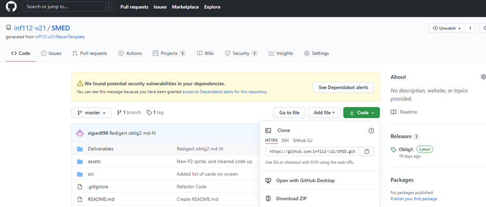
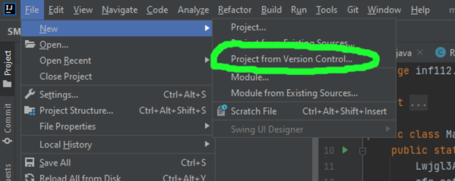
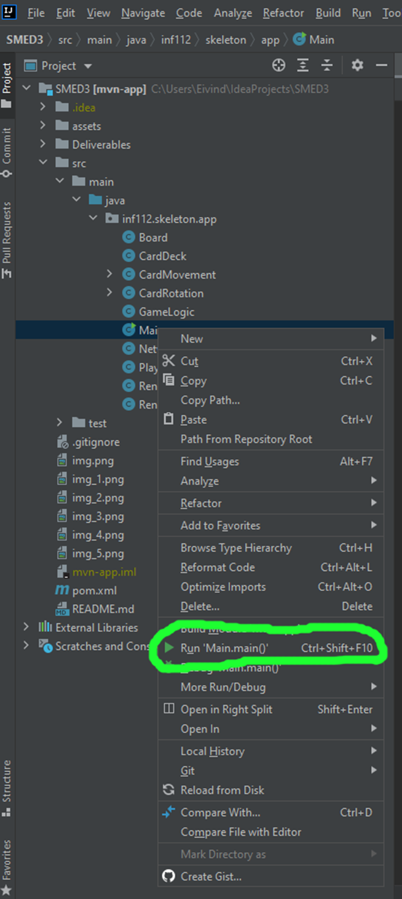

#Step by step guide - starte programmet

1. Pulle programmet fra github til din IDE.
   
   Til å begynne med må programmet pulles fra github til Java IDE’en som du bruker. 
   IDE’en som brukes i denne guiden er IntelliJ.  IntelliJ kan lastes ned her: https://www.jetbrains.com/idea/
   For å pulle prosjektet fra github må du gå til github repositoriet og klikke på den grønne «Code» knappen 
   for å få en HTTPS lenke.
   
   Deretter, går du til din IDE og åpner et nytt prosjekt fra «version controll». 
   I intelliJ gjøres dette ved å trykke på «File» -> «New» -> «Project from Version Control». 
   Det vil åpnes et vindu hvor du limer inn HTTPS lenken i URL feltet. 
   Husk å endre på navnet hvis du skal pulle flere versjoner av prosjektet.

2. Kjøre programmet fra IDE’en:
   
   Applikasjonen kjøres ved å høyreklikke på main funksjonen under src/main/java/inf112.skeleton.app i prosjektet ditt og å trykke på «run» ved den grønne pilen.

3. Bruke applikasjonen
   
   Siden spillet nå har multiplayer trengs to versjoner av prosjektet fra github for å kjøre applikasjonen. 
   For øyeblikket støttes bare multiplayer over lokalt nettverk, 
   derfor for å kjøre programmet må du pulle to prosjekt versjoner på den samme datamaskinen 
   eller pulle prosjektet til en annen datamaskin på samme nettverk.
   Når du har to versjoner av prosjektet oppe, enten på samme datamaskin eller på to ulike datamaskiner, 
   kan begge Main funksjonene kjøres som vist i punkt 2. Når programmet kjøres vil du få muligheten 
   til å velge mellom å være en server som venter på kontakt fra en klient eller en klient som skal sette 
   opp en tilknytning til serveren. Hvis du bruker to datamaskiner må IP-adressen til datamaskinen som 
   er valgt som server skrives inn på klient datamaskinen. Du kan finne IP-adressen din her https://www.med.unc.edu/it/guide/operating-systems/how-do-i-find-the-host-name-ip-address-or-physical-address-of-my-machine/. 
   Hvis du skal kjøre på bare en datamaskin må du skrive inn «127.0.0.1» som er localhost adressen til maskinen din. 
   
   
Deretter kan spillet spilles ved å følge teksten i «run» vinduet i bunnen av IDE’en. Trykk på applikasjons vinduet for at applikasjonen skal registrere keyboard input. Klient versjonen velger kort først. 

##Aoutomatiske tester utførelse
- høgre klikk på den klassen i src/test/java/inf112.skeleton.app du ønsker å kjøre og klikk kjør. 
  dem som gjek gjenom og får grønn "kjek-mark"
  og er godkjent
  
##Manuelle tester utførelse
### Manuell test for at fem kort blir valgt.
- Hvordan testen utføres:
   - Kjør Main og så velg enten client eller server, etter det kan man se kortene i terminalen og velge.
   - Velg 5 kort fra de 9 som blir vist i terminal gjennom nummer taster på tastatur(1-9) der de
      valgte blir fjernet for hvert valg

	- Kriterier for at testen blir godkjent:
		- Velge fem kort.
		- De fem valgte kortene vises i spillet.

### Manuell test for winCondition.
-Hvordan testen utføres:
   - Kjør Main og så velg enten client eller server, etter det kan man se kortene i terminalen og velge.
   - Etter det velg kort og naviger til et flagg. Da skal spillet fryse og en tekst skal si hvem som vant.
   
- Kriterer for at testen blir godkjent:
   - Når en wincondition blir triggeret fryser spillet og det står hvem som har vunnet

### Manuell test for nettverk.
- Hvordan testen utføres:
   - Kjør Main og så velg enten client eller server, sjekk deretter at begge instansene av spillet får valgt kort og gjennomført
      handlinger og den andre mottar/får sett handlingene gjort av den andre spilleren.

- Kriterier for at testen blir godkjent:
    - De to instansene av spillet skal kommunisere med hverandre og får sett hverandres handlinger på spillbrett.

### Manuell test for loseCondition.
- Hvordan testen utføres:
    - Kjør Main og så velg enten client eller server, etter det kan man se kortene i terminalen og velge.
    - Etter det velg kort og naviger utenfor kartet eller til et hull. Da skal spillet fryse og en tekst skal si hvem som tapte.
- Kriterer for at testen blir godkjent:
    - Når en losecondition blir triggeret fryser spillet og det står hvem som har tapt

